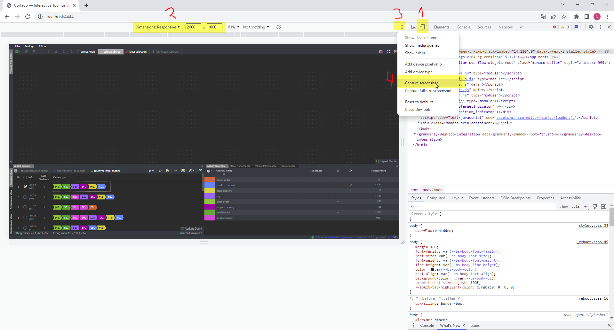
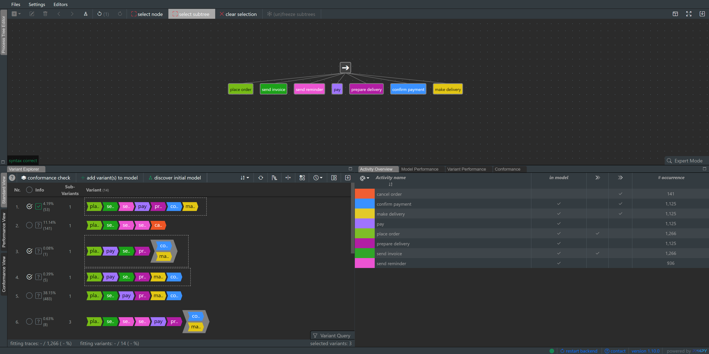

## Internal Notes (remove or move to different location before publication)
### Create Screenshots
For the sake of consistency, screenshots of the complete cortado-window should have the same size. Therefore, start the backend and the frontend and open the frontend in Google Chrome at `http://localhost:4444/`. Open the google chrome developer tools (shortcut `F12`). Follow the next four steps, which are also depicted in the screenshot below:
1. Open the device toolbar
2. Set resolution to 2000 x 1000
3. Open the context menu
4. Click `Capture screenshot`

# Incremental Process Discovery
In this section, you learn how to incrementally improve your current process model by selecting (additional) behavior to be considered in the model.

## Initial Model
The incremental process discovery starts with an initial model. You have multiple options to create an initial model:

1. Click `Files` &rarr; `Import process tree (.ptml)` to import an existing process tree from a file.
2. Use the process tree editor to create a model by hand.
3. Select variants by checking their checkboxes in the variant explorer and click `discover initial model`. The model is discovered using the behavior in the selected variants.

## Incrememtal Discovery
To increase the current model's language, select additional variants by checking their checkboxes in the variant explorer. Then, click `add variant(s) to model` to add the variants to the model. 

> **_NOTE:_**  Selected variants are guaranteed to be in the models language after clicking `add variant(s) to model`. They are guaranteed to stay in the model's language as long as they are selected. Unselcting a variant removes this guarantee. 

> **_EXAMPLE:_** Open cortado and select the top variant of the variant explorer, i.e., check its corresponding checkbox. Click `discover initial model`. Now, you see the same process tree as depicted in the process tree editor in the screenshot below. Select additional variants, e.g., the third and fourth variant as in the screenshot. Click `add variant(s) to model`. Afterward, the model is adjusted.

# Variant Explorer
The variant explorer visualizes the variants, i.e., the unique behavior, of the currently loaded event data. It consists of three different views, focusing on different persepectives of process mining:

1. Standard view: Visualizes variants by using different colors per activity label. 
2. Performance view: Visualizes performance information by coloring the chvrons based on time information.
3. Conformance view: Visualizes to which extend the behavior represented by the variants is present in the current process model.

In the variant explorer, you can perform various actions.

## 